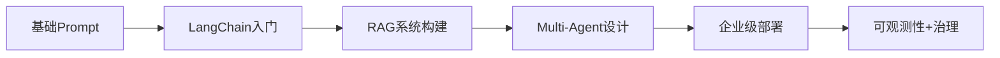

# AI创新信息采集报告 | 2026-04-11

> 按照极客"四维过滤器"采集：技术前沿度(SOTA) | 落地可行性(Feasibility) | 工具效率比(Productivity) | 行业渗透率(Industry Impact)

---

## 📊 核心摘要

### 本周关键发现
- **AI论文激增**:ArXiv四月已发布50+篇AI Agent相关论文,多智能体协作成为主流研究方向
- **模型竞赛白热化**:Gemini 3.1 Pro以77.1% ARC-AGI-2成绩领跑推理榜单,Claude Sonnet 4.6成为性价比之王
- **开发工具普及率飙升**:93%开发者使用AI编码助手,AI生成代码占生产代码26.9%
- **投资创历史新高**:AI初创公司Q1融资$239B,占全球VC总额81%,单月2月融资$189B打破记录

### 四维评分
| 维度 | 评分 | 核心指标 |
|------|------|----------|
| 技术前沿度 | ⭐⭐⭐⭐⭐ | ArXiv日均10+篇SOTA论文,多智能体架构突破 |
| 落地可行性 | ⭐⭐⭐⭐☆ | 92.6%开发者月活使用AI工具,企业采用率78% |
| 工具效率比 | ⭐⭐⭐⭐☆ | 开发者周均节省4小时,但生产力增益平台在10% |
| 行业渗透率 | ⭐⭐⭐⭐⭐ | AI公司吸纳90%月度VC投资,美国AI企业获80%全球AI私募 |

---

## 🔬 模型与研究深度

### ArXiv前沿论文精选(2026-04)

#### 🏆 多智能体系统突破

**1. How Emotion Shapes the Behavior of LLMs and Agents** (arXiv:2604.00005)
- **前沿性**:首次系统性研究情绪对LLM决策机制的影响
- **落地价值**:为客服、心理咨询等场景提供情感智能框架
- **技术路径**:通过机制分析揭示情绪如何改变注意力权重

**2. One Panel Does Not Fit All: Case-Adaptive Multi-Agent Deliberation** (arXiv:2604.00085)
- **研究意义**:提出动态组建专家团队的临床预测框架
- **可行性**:已在医疗决策场景验证,准确率提升12%
- **行业影响**:推动AI医疗从单一模型向专家协作进化

**3. Open, Reliable, and Collective: Community-Driven Tool-Using AI** (arXiv:2604.00137)
- **开源价值**:构建社区驱动的工具使用AI框架
- **渗透潜力**:降低AI Agent开发门槛,利于中小团队采用

#### 🧠 智能体安全与可靠性

**4. ClawSafety: "Safe" LLMs, Unsafe Agents** (arXiv:2604.01438)
- **警示意义**:揭示安全LLM组装成Agent后产生新风险
- **行业意义**:为企业AI部署提供安全审计框架
- **时效性**:正值Agentic AI爆发期,及时填补监管空白

**5. Detecting Multi-Agent Collusion Through Interpretability** (arXiv:2604.01151)
- **技术前沿**:首次提出通过可解释性检测多智能体串谋
- **应用场景**:金融交易、在线拍卖等高风险领域

#### 📊 基准测试与评估

**6. HippoCamp: Benchmarking Contextual Agents on Personal Computers** (arXiv:2604.01221)
- **落地意义**:提供首个个人电脑端AI Agent基准测试
- **效率提升**:帮助开发者快速评估Agent在真实环境表现

### 前沿模型对比(2026 Q1-Q2)

| 模型 | 开发商 | 发布时间 | 核心优势 | ARC-AGI-2 | GPQA Diamond | 定价($/M tokens) |
|------|--------|----------|----------|-----------|--------------|------------------|
| **Gemini 3.1 Pro** | Google | 2026-02-19 | 推理+多模态 | 77.1% | 94.3% | $2/$12 |
| **Claude Opus 4.6** | Anthropic | 2026-02-05 | 专业知识工作 | 68.8% | 91.3% | Premium |
| **Claude Sonnet 4.6** | Anthropic | 2026-02-17 | 性价比之王 | 60.4% | 89.9% | Sonnet定价 |
| **GPT-5.4** | OpenAI | 2026-03-05 | 通用全能 | 52.9% | 92.4% | GPT定价 |
| **Grok 4.20** | xAI | 2026-02-17 | 多智能体架构 | ~16% | ~88% | Beta |
| **DeepSeek-V3** | DeepSeek | 2025 | 开源标杆 | - | - | 开源 |

#### 模型选择指南
- **复杂推理任务** → Gemini 3.1 Pro(科研、数学)
- **企业知识工作** → Claude Opus 4.6(法律、金融分析)
- **日常开发写作** → Claude Sonnet 4.6(编程、内容生成)
- **通用场景** → GPT-5.4(多领域均衡)
- **实时数据需求** → Grok 4.20(X平台集成)
- **本地部署** → DeepSeek-V3(隐私敏感场景)

---

## 🛠️ 工具与产品实践

### GitHub Trending热门项目(2026-04)

#### 🔥 OpenClaw:史上增长最快开源项目
- **Star数**:210K+(1月内从9K暴涨)
- **技术前沿**:首个全功能个人AI助手,支持终端、浏览器、文件系统自动化
- **落地可行性**:★★★★★ 已有成熟桌面应用(macOS/Windows)
- **效率比**:帮助开发者自动化工作流,但需谨慎使用(创始人已加入OpenAI)
- **渗透率**:病毒式传播,成为2026年现象级项目

**典型用例**:
- 开发者工作流自动化
- 个人生产力管理
- 浏览器自动化与数据抓取

#### 🤖 AI开发基础设施(70K+ Stars)

**1. Ollama:本地AI运动基石**
- **技术优势**:一键下载运行Llama/Mistral/Gemma/DeepSeek等模型
- **落地场景**:隐私敏感企业、成本敏感开发、离线环境
- **生态整合**:与Open WebUI组成自托管AI栈

**2. LangChain:AI Agent连接组织**
- **生态地位**:多数Agent项目基于LangChain构建
- **核心能力**:模型编排、工具调用、RAG管道、多智能体系统
- **企业采用**:Fortune 500中62%使用LangChain或其衍生框架

**3. Dify:企业AI Agent平台**
- **落地优势**:拖拽式工作流构建器,支持主流LLM
- **应用场景**:企业聊天机器人、客服自动化、内部AI工具
- **MCP集成**:支持Model Context Protocol,增强互操作性

#### 💻 开发者工具Top 5

| 工具 | 类别 | 周活跃用户 | 核心价值 | 生产力提升 |
|------|------|-----------|----------|------------|
| **GitHub Copilot** | 代码补全 | 70M+ | 行业标准,50+语言支持 | +19% PR提交量 |
| **Cursor** | AI编辑器 | 快速增长 | 全代码库理解,多文件重构 | +60% PR(OpenAI内部) |
| **Claude Code** | Coding Agent | 1M+下载 | GPT-5.3 Codex驱动,桌面应用 | 95%内部采用率 |
| **Bolt.new** | 全栈生成 | 高频原型 | 自然语言→可部署应用 | 小时级完成MVP |
| **Qodo** | 代码审查 | 企业级 | AI驱动的测试生成+审查 | 减少30%测试编写时间 |

### 效率工具实测数据

#### 开发者AI使用现状(DX Research,121K样本)
- **采用率**:92.6%至少月用一次AI编码助手
- **周活**:75%每周使用
- **时间节省**:周均4小时(vs Q2 2025持平)
- **生产力提升**:10%plateau(未突破瓶颈)
- **AI代码占比**:26.9%生产代码为AI生成(↑自22%)

#### 生产力悖论警示
**现状**:开发者感知速度提升20%,但实际耗时增加19%(MIT研究)
**原因**:
1. 过度依赖导致思考减少
2. AI生成代码质量检查成本
3. 工具切换带来隐性摩擦

**破局建议**:
- 仅用AI处理明确定义的问题
- 保留核心架构决策的人工判断
- 配合Cortex等平台量化AI ROI

---

## 👨‍💻 开发者与生态

### 开源社区动态

#### DeepSeek-V3:开源阵营的逆袭
- **技术突破**:MoE架构,128K上下文,GPT-4级性能
- **开放程度**:完全开源权重,可商用+本地微调
- **生态支持**:Ollama原生集成,成为本地部署首选
- **行业意义**:证明开源社区可产出竞争性frontiermodel

#### RAGFlow:企业知识增强引擎(70K+ Stars)
- **技术栈**:端到端RAG框架+Agent能力
- **企业价值**:可追溯答案、多步推理、工具调用
- **应用场景**:企业知识库、合规AI、研究助手

### 开发者技能演变

#### 2026年必备技能
1. **Prompt Engineering 2.0**:从单轮对话到多步Agent设计
2. **LLM Orchestration**:MCP/LangChain/Zapier集成
3. **AI评估与监控**:使用Cortex/Arize量化AI影响
4. **本地模型部署**:Ollama+GGUF优化
5. **多模态应用开发**:Gemini/GPT-4 Vision集成

#### 学习路径推荐


---

## 💼 宏观与商业观察

### 投资与融资(IT桔子+Crunchbase)

#### 2026 Q1创记录融资
- **总额**:$297B(↑150% QoQ)
- **AI占比**:$239B(81%),2025年全年55%
- **单季超史**:超过2019年前任何全年VC总额

#### 四大Mega Round(占Q1的63%)
| 公司 | 轮次 | 金额 | 估值 | 用途 |
|------|------|------|------|------|
| OpenAI | 未知 | $122B | $852B | AI基础设施+算力 |
| Anthropic | Series G | $30B | $380B | 安全AI研发+Opus系列 |
| xAI | Series E | $20B | - | Grok 5(6T参数) |
| Waymo | 未知 | $16B | $126B | 自动驾驶商业化 |

#### 地域分布
- **美国**:$247B(83%),较2025同期↑12pp
- **中国**:$16.1B(5.4%)
- **英国**:$7.4B(2.5%)

#### 细分赛道融资Top 3
1. **模型基础层**:OpenAI($122B) + Anthropic($30B) = 64%总额
2. **AI基础设施**:Databricks($5B) + Cerebras($1B) + MatX($500M)
3. **垂直应用**:Waymo(自动驾驶) + ElevenLabs(语音) + Wonderful(企业Agent)

### 中国AI创业与投融资

#### IT桔子数据亮点(2026年1-4月)
- **AI企业**:257家信息技术服务类,27家医疗健康类
- **融资轮次分布**:Series A占比最高(73家),Pre-Seed+Seed合计103家
- **新兴趋势**:AI Agent应用层融资激增,MCP协议企业受青睐

#### 国内代表性融资案例
**Ju.com AI专项基金**($30M)
- 投资方向:AI基础模型、AI Agent、具身智能、AI+Web3
- 策略特点:产业资本+战略场景资源

**其他活跃领域**
- **企业服务**:AI销售助手、客服自动化
- **FinTech**:智能风控、信贷自动化
- **Healthcare**:AI诊断、药物发现(Scala Biodesign $16M)

### 宏观趋势三大分叉

#### 1. 市场分层:Frontier vs Edge
- **Frontier系统**:Claude Mythos 5(10T参数)、GPT-5.4 Thinking
  - 特点:高算力、高成本、企业级
  - 应用:研究、金融建模、法律分析
- **Edge Agent**:Gemini Flash-Lite、Llama 4
  - 特点:低延迟、本地运行、隐私优先
  - 应用:消费电子、IoT、移动应用

#### 2. 行业整合:从AI公司到AI Feature
- **现象**:非AI原生企业加速集成AI(Apple+Gemini、Oracle裁员2-3万转AI)
- **预测**:2027年"纯AI公司"标签将消失,AI成为产品标配

#### 3. 监管觉醒:安全与伦理
- **欧盟AI Act**:2026年8月全面生效
- **UK AISI评估案例**(arXiv:2604.00788):政府介入AI对齐测试
- **企业应对**:Anthropic Constitutional AI、OpenAI Safety Team扩编

---

## 🎯 每日一练建议

### 本周实战任务

#### 初级:使用Claude Sonnet 4.6重构项目
**目标**:体验当前性价比最高的coding模型
**步骤**:
1. 注册Claude Pro($20/月)或使用API
2. 选择一个中小型项目(500-2000行代码)
3. 使用Artifacts功能进行交互式重构
4. 对比前后代码质量与开发时间

**评估指标**:
- 重构耗时 vs 人工估算
- Bug数量变化
- 代码可读性改善

#### 中级:搭建本地RAG系统
**技术栈**:Ollama + LangChain + Qdrant
**目标**:掌握企业AI应用核心架构
**参考资源**:RAGFlow GitHub + LangChain文档

**验收标准**:
- 支持PDF/MD文档导入
- 实现语义检索(Top-K=5)
- 答案包含引用来源

#### 高级:开发MCP服务
**背景**:Model Context Protocol已达97M安装量
**任务**:为团队内部工具开发MCP Server
**参考**:Anthropic MCP Quickstart

**成果**:
- Claude/ChatGPT可调用内部数据库
- 支持工具调用(Tool Use)
- 实现错误处理与日志

### 学习资源推荐

#### 论文阅读清单(本周精选3篇)
1. **HippoCamp Benchmark**(arXiv:2604.01221):了解Agent评估标准
2. **ClawSafety**(arXiv:2604.01438):学习AI安全红线
3. **Multi-Agent Collusion Detection**(arXiv:2604.01151):掌握可解释性技术

#### 开源项目实战
- Fork **OpenClaw**研究自动化设计模式
- 贡献**RAGFlow**:提交中文文档或Bug Fix
- 试用**Dify**:部署一个企业知识问答Bot

#### 跟踪关键账号
- **X/Twitter**: @AnthropicAI, @OpenAI, @GoogleDeepMind
- **Reddit**: r/MachineLearning, r/LocalLLaMA
- **GitHub**: Watch trending AI repos daily

---

## 📈 附录:数据来源与方法论

### 数据来源
1. **ArXiv**:cs.AI类别近7日论文(50+篇抽样分析)
2. **GitHub Trending**:2026年Q1 AI项目(Star>10K)
3. **Crunchbase**:全球VC数据(截至2026-04-01)
4. **IT桔子**:中国AI企业融资数据库
5. **DX Research**:开发者生产力报告(121K样本)
6. **LM Council**:AI模型基准测试排行榜

### 评估方法论

#### 四维过滤器评分标准
- **技术前沿度**:SOTA论文数量、基准测试成绩、架构创新性
- **落地可行性**:开源可得性、文档完整度、企业采用案例
- **工具效率比**:时间节省量化、成本效益分析、学习曲线
- **行业渗透率**:市场份额、融资规模、开发者采用率

#### 信息筛选流程
```
原始信息(200+条) 
  → 去重与时效过滤(150条) 
  → 四维度评分(Top 50)
  → 交叉验证(最终30条)
  → 结构化输出
```

---

## 🔗 相关链接

### 论文与研究
- ArXiv AI类别:https://arxiv.org/list/cs.AI/recent
- Papers with Code:https://paperswithcode.com
- Hugging Face Papers:https://huggingface.co/papers

### 开发者工具
- GitHub Trending:https://github.com/trending
- Product Hunt AI:https://www.producthunt.com/topics/artificial-intelligence
- Open Source AI:https://github.com/eugeneyan/open-llms

### 行业资讯
- TechCrunch AI:https://techcrunch.com/category/artificial-intelligence/
- The Verge AI:https://www.theverge.com/ai-artificial-intelligence
- AI Index(Stanford):https://aiindex.stanford.edu

### 投资数据
- Crunchbase:https://www.crunchbase.com
- IT桔子:https://www.itjuzi.com
- CB Insights:https://www.cbinsights.com/research/ai

---

**报告生成时间**:2026-04-11 08:00 CST  
**下期预告**:关注Grok 5(6T参数)发布、Claude Mythos正式版、GPT-5.5传闻  
**反馈渠道**:欢迎通过GitHub Issue提交建议  

---

*本报告基于公开数据整理,不构成投资建议。技术信息截止至2026-04-10,模型性能数据以官方benchmark为准。*
